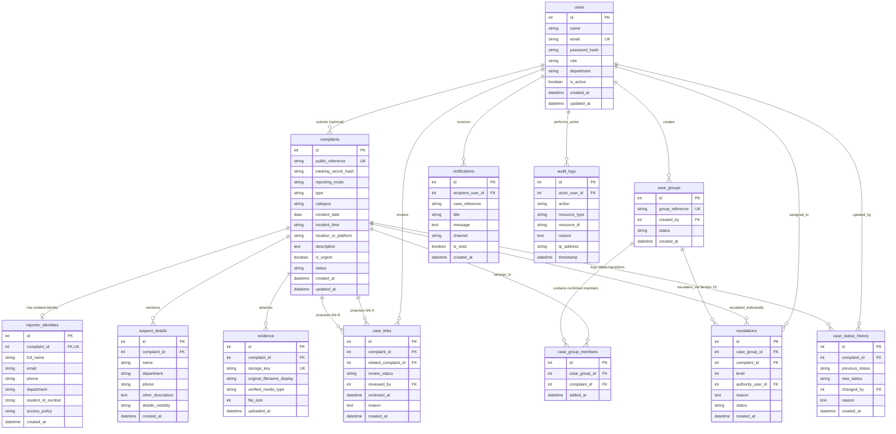

# Campus Safety & Harassment Reporting System

A privacy-first, full-stack digital safety platform designed to empower students to report ragging, harassment, stalking, and cyberbullying while providing campus authorities with an accountable, auditable, and human-reviewed case management system.

---

## 🌟 Key Features

1. **Anonymous & Confidential Modes**:
   - **Anonymous**: Zero identity records stored. No login required. Issues a one-time cryptographic tracking secret.
   - **Confidential**: Reporter contact information is query-isolated in a separate vault table (`reporter_identities`) and concealed from standard staff views.
2. **Section 23 Repeat-Report Pattern Review**:
   - Algorithmic proposals are flagged as `pending` candidate pairs for **human review only**.
   - Reviewers examine side-by-side incident summaries on `review.html` and record a mandatory rationale.
   - **Confirmed Pattern Ladder**:
     - 1 distinct confirmed report in group &rarr; **Level 1 (HOD)**
     - 2 distinct confirmed reports in group &rarr; **Level 2 (Dean)**
     - 3+ distinct confirmed reports in group &rarr; **Level 3 (Higher Authority)**
   - Unreviewed or rejected matches never inflate repeat-report counts.
3. **Urgent Fast-Track Safety**:
   - Incidents with immediate safety risks (`is_urgent=True`) route directly to priority safeguarding review without waiting for match thresholds.
4. **Sleek Modern UI/UX**:
   - `#121212` Workspace Canvas
   - `#1E1E1E` Elevated Panels
   - `#38B6FF` Primary Cyan Accent
   - `#FF5A5F` Urgent Coral Alert
   - WCAG 2.1 AA/AAA accessible focus rings, keyboard navigability, and responsive layouts.
5. **Private Evidence Storage**:
   - Uploaded files are stored in private disk storage with random UUID keys outside the web root. Download requests are authorized and logged to an audit trail.

---

## 🗄️ Entity-Relationship (ER) Diagram

The system architecture implements data isolation (separating reporter identities from complaint logs) and explicit group membership for Section 23 repeat-report escalation.



---

## 🚀 Quick Start Guide

### 1. Requirements
- Python 3.11+
- Git

### 2. Virtual Environment Setup
```bash
# Clone or navigate to directory
cd "/Users/manoranjankumar.s/Documents/new hack"

# Create venv and install dependencies
/opt/homebrew/bin/python3.11 -m venv backend/.venv
./backend/.venv/bin/pip install -r backend/requirements.txt
```

### 3. Seed Demo Data
```bash
PYTHONPATH=. ./backend/.venv/bin/python database/seeds/seed_demo.py
```

### 4. Run Development Server
```bash
PYTHONPATH=. ./backend/.venv/bin/uvicorn backend.app.main:app --host 0.0.0.0 --port 8000
```
Open your browser at: **`http://localhost:8000`**

---

## 👥 Demo Authority Accounts

Quick-fill buttons are provided on the login page (`http://localhost:8000/login.html`):

| Role | Email | Password | Department |
| :--- | :--- | :--- | :--- |
| **HOD (Level 1)** | `hod.cse@campus.edu` | `HodPass2026!` | Computer Science & Engineering |
| **Dean (Level 2)** | `dean.studentaffairs@campus.edu` | `DeanPass2026!` | Student Affairs & Welfare |
| **Higher Authority (Level 3)** | `director.office@campus.edu` | `DirectorPass2026!` | Office of the Director / Ombudsman |
| **Administrator** | `admin@campus.edu` | `AdminPass2026!` | Campus Administration |
| **Student** | `student.demo@campus.edu` | `StudentPass2026!` | Computer Science & Engineering |

---

## 🧪 Running Automated Tests

Run the complete pytest test suite (covers intake, isolation, tracking, permissions, evidence, matching, and Section 23 escalation):

```bash
PYTHONPATH=. ./backend/.venv/bin/pytest backend/tests -v
```

---

## 🧭 Page Navigation Map

- **Public Landing Page**: `http://localhost:8000/index.html` (or `/`)
- **Submit Complaint Form**: `http://localhost:8000/report.html`
- **Track Status Portal**: `http://localhost:8000/track.html`
- **Authority Login**: `http://localhost:8000/login.html`
- **Authority Dashboard**: `http://localhost:8000/dashboard.html`
- **Match Review Matrix (Section 23)**: `http://localhost:8000/review.html`
- **Administration & Audit Trail**: `http://localhost:8000/admin.html`
